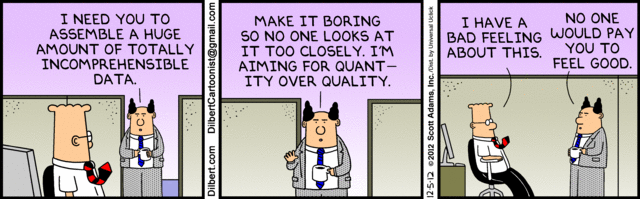
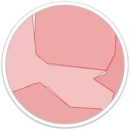
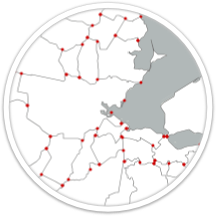

# GML.Next
## GML, GeoJSON, TopoJSON, MVT

Edward Mac Gillavry, Webmapper

17 juli 2018

---

---

## GML (1)

* BAG, BRT en BGT: NLExtract<!-- .element: class="fragment" data-fragment-index="1" -->
* IMKL en IMRO: ogr2ogr<!-- .element: class="fragment" data-fragment-index="2" -->
* Omgevingsdocumenten: ogr2ogr en xmlstarlet<!-- .element: class="fragment" data-fragment-index="3" -->

---

## GML (2)

* Validatie
* Portability
* **Bulk-download**

---

## GeoJSON (1)

* WGS-84 (decimalen!)
* Volledige kolomname_
* Makkelijk te genereren
* Kleine datasetjes

---

## GeoJSON (2)

* Geeft geo '*bad reputation*'
* Te grote bestanden
* Slivers door afrondingsverschillen

---

## TopoJSON

* Topologische generalisatie
* Drop lege vlakken
* Drop punten

---

## Mapbox Vector Tiles (MVT)

* BRT/BGT voor PDOK
* Datalab Amsterdam
* Webmapper referentiekaart

---

## DataVisNL

* Mapbox Vector Tiles o.b.v. basisregistraties
* Minder data-opslag
* Minder data-transport
* behoud oorspronkelijke ID

---

## Conclusie

* GML voor bulk-download <!-- .element: class="fragment" data-fragment-index="1" -->
* Mapbox Vector Tiles voor online <!-- .element: class="fragment" data-fragment-index="2" -->
* Oorspronkelijke id linkt naar oorspronkelijke geometrie <!-- .element: class="fragment" data-fragment-index="3" -->
* Cesium? <!-- .element: class="fragment" data-fragment-index="4" -->
